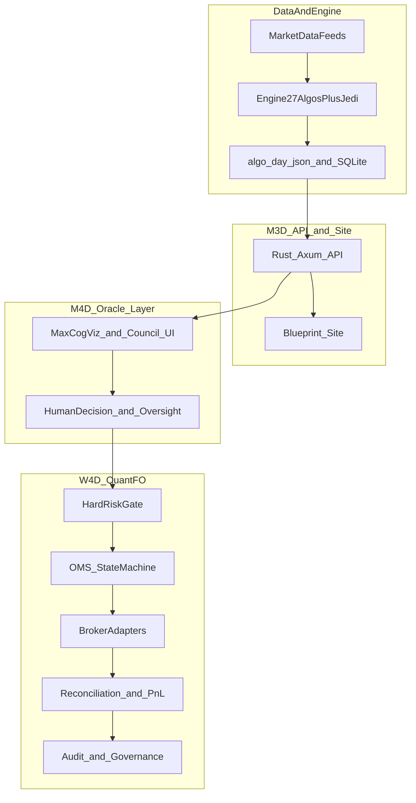

# I-OPT-OOO — Visualization & Diagram Spec (SVG · TSX · ReactFlow)

**Goal:** One coherent **cognitive + systems** visual language across M3D/M4D/W4D — static architecture for docs, interactive maps for the command room.

---

## 1) When to use which format

| Format | Best for | Repo alignment |
|--------|----------|----------------|
| **SVG (static)** | Canonical architecture, PDFs, slides, version control | [BUILD-W4D-DOCS/worldquant_system_architecture.svg](../BUILD-W4D-DOCS/worldquant_system_architecture.svg), [AGENT/SYSTEM-MAP.svg](../../AGENT/SYSTEM-MAP.svg), flow SVGs in BUILD-W4D-DOCS |
| **TSX / inline SVG** | Live UI components (radar, orbs, custom panels) | `site/src/pages/MaxCogViz.tsx`, M4D visual language per [AGENT/M4D-BRIEF.md](../../AGENT/M4D-BRIEF.md) |
| **ReactFlow / @xyflow/react** | Editable node–edge maps, flow studios, “oracle path” exploration | M4D stack notes FlowMaps Studio; see also `M4D/src/pages/FlowMapsStudioPage.tsx`, `M4D/src/viz/MaxCogVizXYFlow.jsx` under repo root |

**Mermaid:** Useful in chat or ephemeral specs; this repo’s long-lived visuals favor **SVG + ReactFlow**, not mermaid-as-SSOT.

---

## 2) Layer diagram (reference — mental model)

---

## 3) SVG standards (new assets)

- **Naming:** `system_<topic>_<variant>.svg` under `APP-DOC/BUILD-W4D-DOCS/` or `APP-DOC/I-OPT-OOO/assets/` if you add a subfolder.
- **Layers:** (1) data plane, (2) compute/engine, (3) API, (4) UI, (5) execution/risk — use groups for each.
- **Text:** minimal labels; long prose belongs in Markdown beside the figure.
- **Accessibility:** if embedded in HTML, provide `<title>` and `desc` in SVG or adjacent caption.

---

## 4) TSX / component standards

- **Reuse** existing palette and density from Blueprint site (`site/`) for M3D; M4D may use Tailwind / custom orb language per M4D-BRIEF — do not mix blindly on one page without design pass.
- **One hero metaphor** per screen (e.g., PulseHero orb + satellites) so cognitive load stays bounded.
- **Numbers:** JEDI as continuous score; avoid binary “green light” only.

---

## 5) ReactFlow (@xyflow/react) standards

- **Node types:** `DataFeed`, `EngineRun`, `CouncilSnapshot`, `OraclePanel`, `RiskGate`, `OrderIntent`, `Broker`, `Fill`, `Reconciliation`.
- **Edges:** label with contract name (`/v1/council`, `/v1/algo-day`, execution route) where it helps debugging.
- **Persistence:** export graph JSON for “architecture as code”; optional future: store layout in local/session storage for Flow Studio.

---

## 6) Existing assets to reuse before drawing new ones

| Asset | Path |
|-------|------|
| WorldQuant-style system map | [BUILD-W4D-DOCS/worldquant_system_architecture.svg](../BUILD-W4D-DOCS/worldquant_system_architecture.svg) |
| Regime / risk layers | [BUILD-W4D-DOCS/regime_risk_layer.svg](../BUILD-W4D-DOCS/regime_risk_layer.svg), [regime_signal_pipeline_flow.svg](../BUILD-W4D-DOCS/regime_signal_pipeline_flow.svg) |
| Alpha pipeline | [BUILD-W4D-DOCS/alpha_signal_pipeline.svg](../BUILD-W4D-DOCS/alpha_signal_pipeline.svg) |
| Entry/exit decision flow | [BUILD-W4D-DOCS/entry_exit_decision_flow.svg](../BUILD-W4D-DOCS/entry_exit_decision_flow.svg) |
| Co-trader surge (HTML) | [BUILD-ICT-VOL/surge_cotrader_architecture.html](../BUILD-ICT-VOL/surge_cotrader_architecture.html) |
| Alt data pipeline | [APP-DOC/alt_data_ingestion_pipeline.svg](../alt_data_ingestion_pipeline.svg) |
| I-OPT governance layers (M3D→M4D→risk→W4D) | [assets/iopt_ooo_system_layers.svg](assets/iopt_ooo_system_layers.svg) |

---

## 7) I-OPT asset (shipped)

- [assets/iopt_ooo_system_layers.svg](assets/iopt_ooo_system_layers.svg) — static layers + hard risk band. **Edit the `.svg` only**; [assets/DIAGRAM-SVG-SOURCE.md](assets/DIAGRAM-SVG-SOURCE.md) is a pointer (no duplicated XML).
- Optional: import the same node labels into M4D Flow Studio (`@xyflow/react`) if you want an editable live map.
